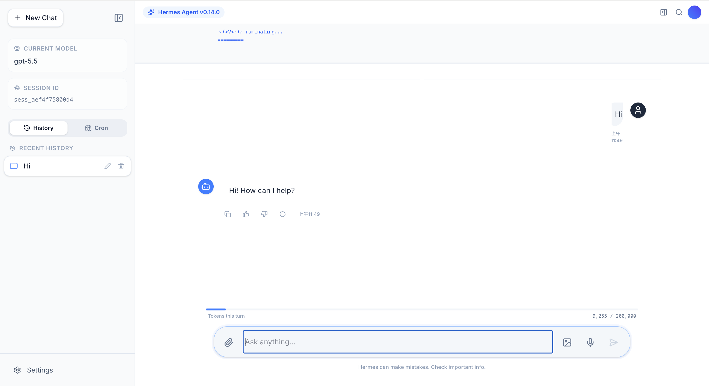

# Hermes Agent WebUI Universal

Experimental portable Web UI for [Hermes Agent](https://hermes-agent.nousresearch.com/docs).

Status: alpha. This project is useful for local testing, but the install flow, API bridge, and UI behavior may still change. Review the security notes before exposing it outside your own machine.



Note: This screenshot reflects the author's local environment. It does not mean this project includes GPT-5.5 or any paid model, provider access, API key, or subscription.

## What It Does

Hermes Agent WebUI Universal runs a local Vite frontend and a FastAPI REST proxy that talks to your existing Hermes Agent installation.

It does not bundle Hermes Agent, and it should not contain your API keys, `.env`, `config.yaml`, session database, or logs.

Current features:

- Web chat with Hermes Agent
- Uses the user's existing Hermes model/provider configuration
- Displays CLI session history together with Web UI overlay sessions
- Recent History and Cron Jobs sidebar views
- Existing Hermes cron job display
- File browser and upload endpoints
- Tool execution monitor
- Health endpoint for setup/debugging

## Requirements

- Hermes Agent installed and configured
- `hermes setup` completed
- Node.js/npm available
- Python environment from Hermes Agent

The Hermes installer usually provides Node.js under the Hermes home directory. `start.sh` adds `$HERMES_HOME/node/bin` to `PATH` automatically when that directory exists.

## Quick Start

Clone or unpack this project, then run:

```bash
./install.sh
```

The installer searches for your Hermes home and installs the Web UI into:

```text
$HERMES_HOME/web-ui
```

If `HERMES_HOME` was discovered automatically, use the install path printed by `install.sh`.

Start it:

```bash
cd "$HERMES_HOME/web-ui"
./start.sh
```

Open:

```text
http://127.0.0.1:3000
```

Stop or restart:

```bash
./stop.sh
./restart.sh
```

## Path Discovery

The scripts are designed for Hermes installs that are not always under `~/.hermes`.

Discovery order:

1. `HERMES_HOME` and `HERMES_AGENT_DIR` environment variables
2. A `.hermes` directory near the Web UI or one of its parent directories
3. `$HOME/.hermes`
4. `/work/$USER/.hermes`
5. `/workspace/$USER/.hermes`
6. `/mnt/data/.hermes`
7. A limited-depth search under common workspace roots

The agent source directory is resolved from:

1. `HERMES_AGENT_DIR`
2. `$HERMES_HOME/hermes-agent`
3. `$(dirname "$HERMES_HOME")/hermes-agent`

If your setup is custom, pass the paths explicitly:

```bash
HERMES_HOME=/path/to/.hermes HERMES_AGENT_DIR=/path/to/hermes-agent ./start.sh
```

## Configuration

`start.sh` supports these environment variables:

```bash
HERMES_HOME=/path/to/.hermes
HERMES_AGENT_DIR=/path/to/hermes-agent
HERMES_WEB_HOST=127.0.0.1
HERMES_WEB_PORT=3001
HERMES_WEB_UI_HOST=127.0.0.1
HERMES_WEB_UI_PORT=3000
VITE_HERMES_API_URL=/api
```

`install.sh` also supports:

```bash
HERMES_WEB_UI_TARGET=/path/to/install/web-ui
```

Example test install:

```bash
HERMES_WEB_UI_TARGET="$HERMES_HOME/hermes-agent-webui-universal" ./install.sh
```

## Important Files

Hermes-owned files live under the user's Hermes home:

```text
$HERMES_HOME/config.yaml
$HERMES_HOME/.env
$HERMES_HOME/state.db
$HERMES_HOME/web_proxy_sessions.db
$HERMES_HOME/logs/
$HERMES_HOME/sessions/
```

Do not commit or share those files. They may contain credentials, private prompts, local file paths, session data, or other sensitive information.

## Security Notes

By default, both services bind only to localhost:

```text
Frontend: http://127.0.0.1:3000
Backend:  http://127.0.0.1:3001
```

Do not expose this Web UI directly to the public internet. Once connected to Hermes, the UI may be able to trigger tools that read files, write files, run terminal commands, manage cron jobs, or interact with other local services depending on your Hermes configuration.

If you intentionally want LAN access, bind explicitly:

```bash
HERMES_WEB_HOST=0.0.0.0 HERMES_WEB_UI_HOST=0.0.0.0 ./start.sh
```

Use this only on trusted networks.

## Manual Development

Terminal 1, start the REST proxy:

```bash
cd "$HERMES_HOME/web-ui"
export HERMES_HOME=${HERMES_HOME:-/path/to/.hermes}
export HERMES_AGENT_DIR=${HERMES_AGENT_DIR:-/path/to/hermes-agent}
export PYTHONPATH="$HERMES_AGENT_DIR:$PYTHONPATH"
source "$HERMES_AGENT_DIR/venv/bin/activate"
python backend/hermes_rest_proxy.py --host 127.0.0.1 --port 3001
```

Terminal 2, start Vite:

```bash
cd "$HERMES_HOME/web-ui"
HERMES_PROXY_TARGET=http://127.0.0.1:3001 npm run dev -- --host 127.0.0.1 --port 3000
```

Build the frontend:

```bash
npm install
npm run build
```

## Health Check

After the REST proxy starts:

```bash
curl http://127.0.0.1:3001/api/health
```

The response includes setup/debugging fields such as:

- `model`
- `provider`
- `version`
- `hermes_home`
- `hermes_agent_dir`
- `setup_ok`
- feature flags

It should not return API keys or `.env` contents.

## Troubleshooting

### Hermes config not found

Run:

```bash
hermes setup
```

Or pass the Hermes home explicitly:

```bash
HERMES_HOME=/path/to/.hermes ./start.sh
```

### Could not import Hermes Agent modules

The backend could not find the Hermes Agent source checkout. Try:

```bash
HERMES_AGENT_DIR=/path/to/hermes-agent ./start.sh
```

### npm not found

Install Node.js LTS, or make sure the Hermes-provided Node.js directory is available:

```bash
export PATH="$HERMES_HOME/node/bin:$PATH"
```

### Ports already in use

Change the ports:

```bash
HERMES_WEB_PORT=3101 HERMES_WEB_UI_PORT=3100 ./start.sh
```

## Publishing Checklist

Before making a fork or copy public, check that you are not committing:

- `.env`
- `config.yaml`
- `state.db`
- `web_proxy_sessions.db`
- session logs
- OAuth tokens or provider credentials
- local workspace paths inside generated files
- `node_modules`
- `dist`

This repository includes a `.gitignore` intended to block the common risky files, but always inspect `git status` before pushing.
